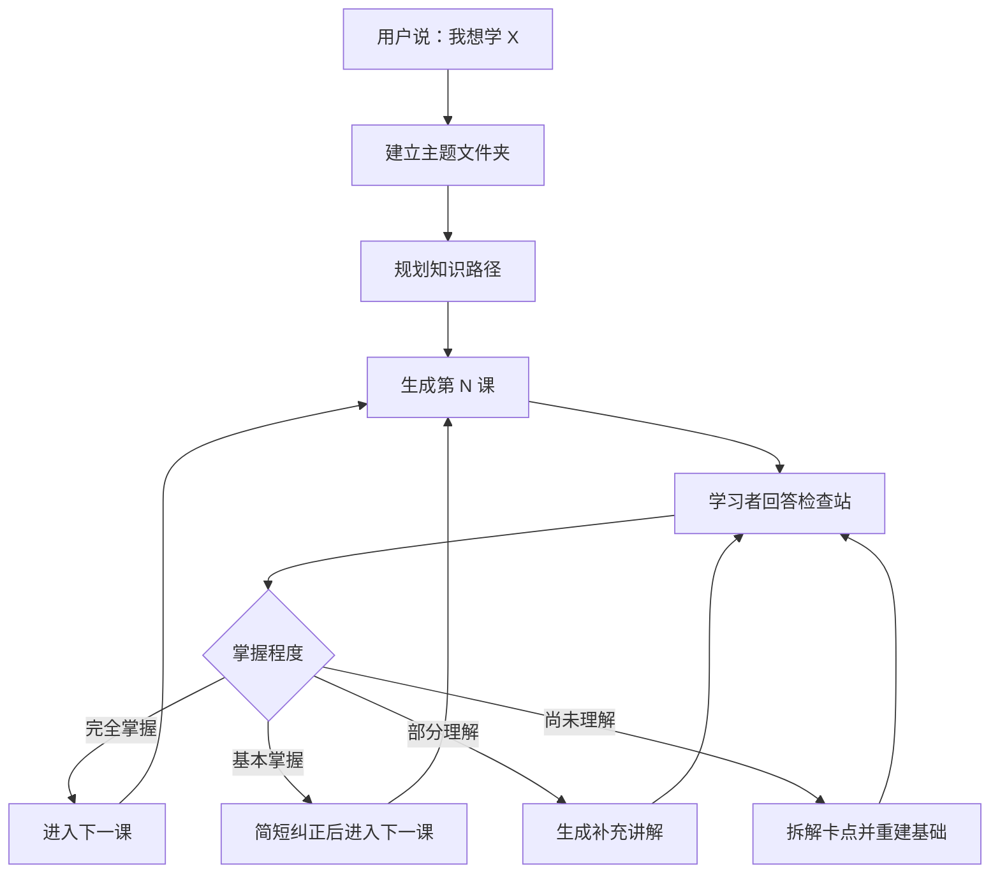

# 学习 learning skill

> 一个基于 Benjamin Bloom「2 Sigma 问题」和掌握学习法的交互式学习 Skill。

[](#)
[](#)
[](#)

## 它解决什么问题

传统学习路径常常默认学习者已经听懂，于是课程不断向前推进。这个 Skill 的设计目标相反：只有当学习者真正掌握当前内容时，才进入下一步。

它会把「我想学 X」转化为一套可持续推进的学习系统：

| 阶段 | Agent 要做什么 | 产物 |
| --- | --- | --- |
| 主题启动 | 识别学习目标，拆解知识图谱 | `主题名/` |
| 路径规划 | 按先后依赖组织学习路线 | 课程列表 |
| 单元教学 | 生成讲解、例子、小结和检查站 | `01_标题.md` |
| 掌握判断 | 根据回答判断理解深度 | 反馈与下一步 |
| 持续跟踪 | 记录掌握情况和误区 | `进度.md` |

## 核心原则

- **掌握优先**：不为了进度跳过未理解的内容。
- **费曼技巧**：用简单语言、类比和例子解释复杂概念。
- **苏格拉底式提问**：用问题推动学习者主动思考。
- **脚手架学习**：每一步都建立在前一步已经掌握的基础上。
- **温和纠偏**：把错误当作诊断工具，而不是批评理由。

## 工作流



## 仓库结构

```text
学习learning-skill/
├── README.md
├── CLAUDE.md
├── learning-skill/
│   ├── SKILL.md
│   └── agents/
│       └── openai.yaml
├── examples/
│   └── Python基础/
│       ├── 进度.md
│       └── 01_变量与数据类型.md
├── source/
│   └── 学习learning.md
└── LICENSE
```

## 使用方式

### 在 Codex / Agent 环境中

把 `learning-skill/` 作为 Skill 目录使用。触发方式可以是：

```text
我想学 Python 基础，请用交互式学习 Skill 带我一步一步学。
```

### 在 Claude Code 仓库中

把根目录的 `CLAUDE.md` 放进学习仓库。之后你可以直接说：

```text
我想学机器学习原理。
```

Agent 会创建主题目录、生成第一课，并根据你的检查站回答决定后续推进。

## 示例

查看 [examples/Python基础](examples/Python基础) 可以看到一套最小示例：进度文件加第一课模板。

## 来源

本仓库根据桌面原始文件 `学习learning.md` 整理而成，并保留在 [source/学习learning.md](source/学习learning.md) 中。
