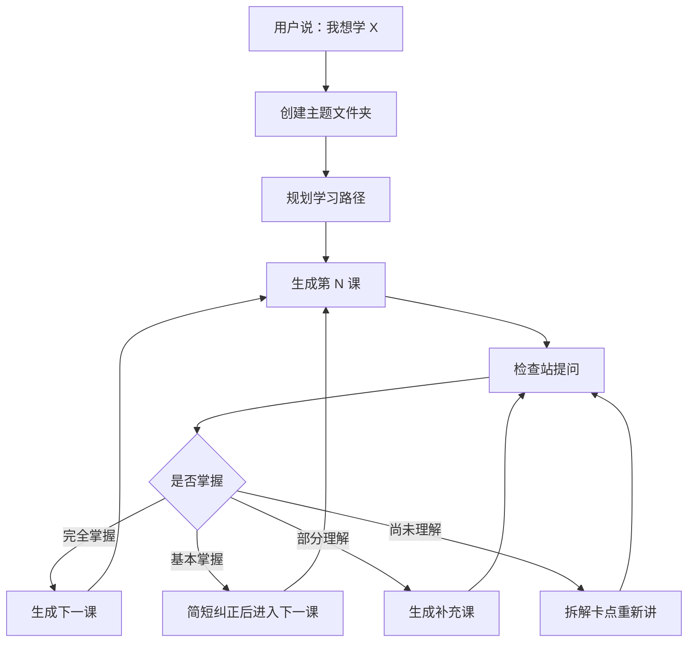
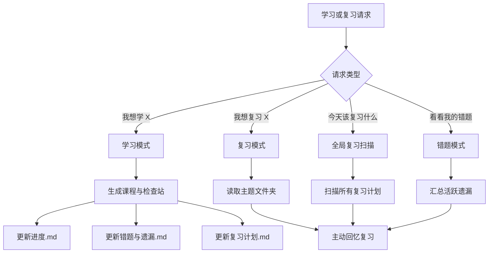

# 学习 learning skill

> 把「我想学 X」变成一个可持续推进、可检查掌握、可回头复习的一对一学习系统。

[](#)
[](#版本说明)
[](#使用方式)
[](#)
[](LICENSE)

## 一句话介绍

这是一个用于 AI Agent 的学习 Skill 仓库。它不是一次性生成课程大纲，而是让 Agent 像一位长期学习教练一样，按你的理解程度推进课程。

仓库现在保留两个版本：

- `learning-skill/`：基础版，轻量、干净，适合专注学习推进。
- `learning-skill-plus/`：Plus 版，在基础版上加入错题、遗漏、复习计划和“多久没学”提醒。

## 版本说明

| 版本 | 目录 | 适合场景 | 核心文件 |
| --- | --- | --- | --- |
| 基础版 | `learning-skill/` | 第一次搭建一对一学习流程，想要简单可靠 | `CLAUDE.md` |
| Plus 版 | `learning-skill-plus/` | 想记录遗漏、安排复习、下次自动回到对应主题 | `CLAUDE.plus.md` |

基础版没有被覆盖。Plus 版是并列新增版本，可以单独安装、单独引用。

## 怎么选

| 你想要 | 推荐版本 |
| --- | --- |
| 只想让 Agent 带你一步一步学 | 基础版 |
| 希望每课后判断是否掌握 | 基础版 |
| 希望记录错题和遗漏 | Plus 版 |
| 希望下次打开时知道该复习什么 | Plus 版 |
| 想问“我多久没学过这个主题了” | Plus 版 |

## 基础版一图解

基础版的核心是「学习推进闭环」：每次只推进一小节，检查掌握后再进入下一步。



基础版主题文件夹通常长这样：

```text
Python基础/
├── 进度.md
├── 01_变量与数据类型.md
├── 02_控制流.md
└── 02b_控制流补充.md
```

## Plus 版一图解

Plus 版在学习推进之外，额外建立复习系统：记录错题、安排复习、下次自动找回主题。



Plus 版主题文件夹固定包含三个长期记录文件：

```text
销售技巧/
├── 进度.md
├── 错题与遗漏.md
├── 复习计划.md
├── 01_需求挖掘.md
└── 02_异议处理.md
```

## 三大教学原则

| 原则 | 在 Skill 里的体现 |
| --- | --- |
| 费曼技巧 | 用简单语言、类比和真实场景解释复杂概念 |
| 苏格拉底式提问 | 用追问引导学习者自己推导，而不是直接塞答案 |
| 脚手架原则 | 从已知推向未知，每一步都建立在前一步之上 |

补充底线：鼓励犯错。错误是判断理解深度的线索，不是批评学习者的理由。

## Plus 版复习效果预览

当你说：

```text
我想复习销售技巧。
```

Plus 版会读取 `examples/销售技巧/` 下的长期记录，然后生成类似这样的复习开场：

```text
你已经 12 天没有学习「销售技巧」了，上次复习是在 2026-05-15。

当前到期复习：
1. 01_需求挖掘：第 3 次复习，到期日期 2026-05-22

这次重点检查你的几个遗漏：
1. 能否区分客户的表层需求和真实购买动机
2. 能否在客户说“太贵了”时先追问，而不是立刻降价

我们先不重读原文，先做主动回忆：
客户说“你们这个太贵了”，请你写出 3 个追问，分别确认预算、价值感和决策风险。
```

## 使用方式

### 使用基础版

把 `learning-skill/` 作为 Skill 目录使用。典型触发语：

```text
我想学 Python 基础，请用交互式学习 Skill 带我一步一步学。
```

如果是在 Claude Code 项目中，把 `CLAUDE.md` 放到学习仓库根目录。

### 使用 Plus 版

把 `learning-skill-plus/` 作为 Skill 目录使用。典型触发语：

```text
我想学销售技巧，请记录我的遗漏和复习计划。
```

复习时可以说：

```text
我想复习销售技巧。
今天该复习什么？
看看我的错题。
我多久没学过销售技巧了？
```

如果是在 Claude Code 项目中，把 `CLAUDE.plus.md` 的内容作为项目级说明使用。

## 仓库结构

```text
学习learning-skill/
├── README.md
├── CLAUDE.md                 # 基础版 Claude Code 指南
├── CLAUDE.plus.md            # Plus 版 Claude Code 指南
├── learning-skill/           # 基础版 Skill
│   ├── SKILL.md
│   └── agents/
│       └── openai.yaml
├── learning-skill-plus/      # Plus 版 Skill
│   ├── SKILL.md
│   └── agents/
│       └── openai.yaml
├── examples/
│   ├── Python基础/
│   │   ├── 进度.md
│   │   └── 01_变量与数据类型.md
│   └── 销售技巧/
│       ├── 进度.md
│       ├── 错题与遗漏.md
│       └── 复习计划.md
├── source/
│   └── 学习learning.md
└── LICENSE
```

## 示例入口

- [Python基础](examples/Python基础)：基础版最小学习示例。
- [销售技巧](examples/销售技巧)：Plus 版复习模块示例。
- [source/学习learning.md](source/学习learning.md)：最初整理前的原始文档。

## 设计边界

- 不一次性生成所有课程。
- 不在学习者没掌握时强行进入下一课。
- Plus 版复习日期一律使用绝对日期，不写“三天后”这类相对时间。
- 高风险主题只做概念学习，不替代专业建议。

## 许可证

MIT License。详见 [LICENSE](LICENSE)。
