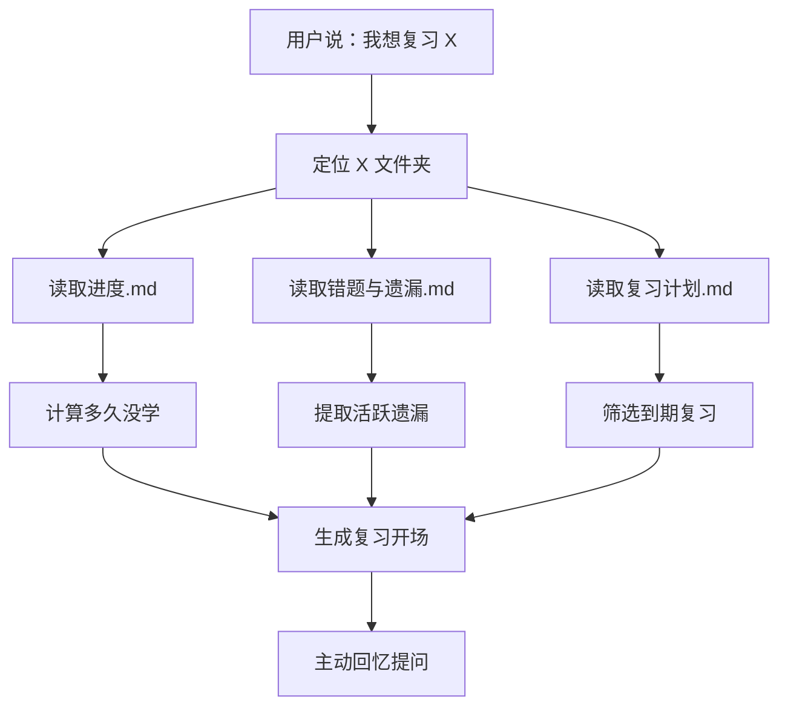

# 学习 learning skill

> 一个基于掌握学习的一对一学习 Skill 仓库。当前保留两个版本：原版与 Plus 版。

[](#)
[](#)
[](#)

## 版本说明

| 版本 | 目录 | 适合场景 |
| --- | --- | --- |
| 原版 | `learning-skill/` | 轻量的一对一学习流程：生成课程、检查站、掌握判断和进度记录 |
| Plus 版 | `learning-skill-plus/` | 在原版基础上增加复习路由、错题遗漏追踪、间隔复习计划和“多久没学”查询 |

原版没有被覆盖，仍然保留在 `learning-skill/`。Plus 版作为独立目录新增，可以单独安装或引用。

## 原版能力

原版会把「我想学 X」转化为一套可持续推进的学习系统：

| 阶段 | Agent 要做什么 | 产物 |
| --- | --- | --- |
| 主题启动 | 识别学习目标，拆解知识图谱 | `主题名/` |
| 路径规划 | 按先后依赖组织学习路线 | 课程列表 |
| 单元教学 | 生成讲解、例子、小结和检查站 | `01_标题.md` |
| 掌握判断 | 根据回答判断理解深度 | 反馈与下一步 |
| 持续跟踪 | 记录掌握情况和误区 | `进度.md` |

## Plus 版新增能力

Plus 版保留三大教学原则，并新增复习系统：

| 用户表达 | Plus 版行为 |
| --- | --- |
| 我想学 X | 新建或继续主题；如果已有到期复习，会先提醒 |
| 我想复习 X | 跳转到对应主题文件夹，读取进度、遗漏和复习计划 |
| 今天该复习什么 | 扫描所有主题的 `复习计划.md` |
| 看看我的错题 | 汇总 `错题与遗漏.md` 中的活跃遗漏 |
| 我多久没学过 X 了 | 读取最后学习日期并计算间隔 |

## 三大教学原则

| 原则 | 含义 |
| --- | --- |
| 费曼技巧 | 用简单语言、类比和真实场景解释复杂概念 |
| 苏格拉底式提问 | 用问题推动学习者主动思考，而不是直接塞答案 |
| 脚手架原则 | 从已知推向未知，每一步都建立在前一步之上 |

## Plus 版复习路由



## 仓库结构

```text
学习learning-skill/
├── README.md
├── CLAUDE.md                 # 原版 Claude Code 指南
├── CLAUDE.plus.md            # Plus 版 Claude Code 指南
├── learning-skill/           # 原版 Skill
│   ├── SKILL.md
│   └── agents/
│       └── openai.yaml
├── learning-skill-plus/      # Plus 版 Skill
│   ├── SKILL.md
│   └── agents/
│       └── openai.yaml
├── examples/
│   ├── Python基础/
│   │   ├── 进度.md
│   │   └── 01_变量与数据类型.md
│   └── 销售技巧/
│       ├── 进度.md
│       ├── 错题与遗漏.md
│       └── 复习计划.md
├── source/
│   └── 学习learning.md
└── LICENSE
```

## 使用方式

### 使用原版

把 `learning-skill/` 作为 Skill 目录使用：

```text
我想学 Python 基础，请用交互式学习 Skill 带我一步一步学。
```

### 使用 Plus 版

把 `learning-skill-plus/` 作为 Skill 目录使用：

```text
我想学销售技巧，请记录我的遗漏和复习计划。
```

复习时可以说：

```text
我想复习销售技巧。
今天该复习什么？
看看我的错题。
```

## 示例

查看 [examples/Python基础](examples/Python基础) 可以看到原版最小学习示例。

查看 [examples/销售技巧](examples/销售技巧) 可以看到 Plus 版复习模块效果：最后学习日期、活跃遗漏、待复习队列和复习记录。

## 来源

本仓库根据桌面原始文件 `学习learning.md` 整理而成，并保留在 [source/学习learning.md](source/学习learning.md) 中。
